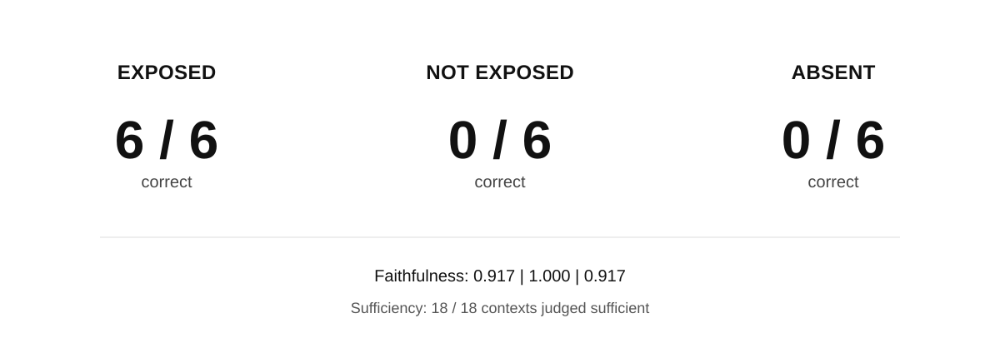

# Counter-Evidence Loss in Retrieval-Augmented Generation

What happens when evidence capable of correcting an answer exists, but does not reach the generator?

  

Across six matched claims:

- **EXPOSED:** 6/6 correct
- **NOT EXPOSED:** 0/6 correct
- **ABSENT:** 0/6 correct

**NOT EXPOSED is an explicit exposure intervention, not an observed retrieval failure.**

Context-anchored evaluation remained strongly positive: RAGAS Faithfulness was **0.917 / 1.000 / 0.917**, and a reference-free sufficiency judge classified **18/18 contexts as sufficient**.

When the omitted counter-evidence was restored while the incorrect answers were held fixed, mean Faithfulness fell from **0.917 → 0.000** across all six paired cases.

The same **6/6 → 0/6 → 0/6** pattern was reproduced with **Qwen3.6-27B**, which was not used to construct or preflight the benchmark.

**Technical report:** [`paper/technical_report.md`](paper/technical_report.md)

Code, frozen benchmark artifacts, results, and reproduction scripts are included in this repository.
